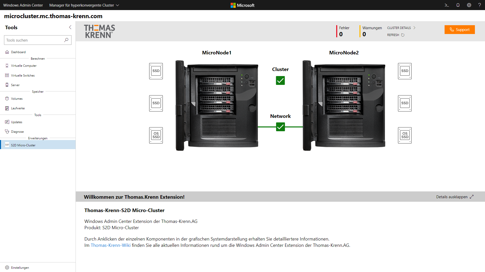
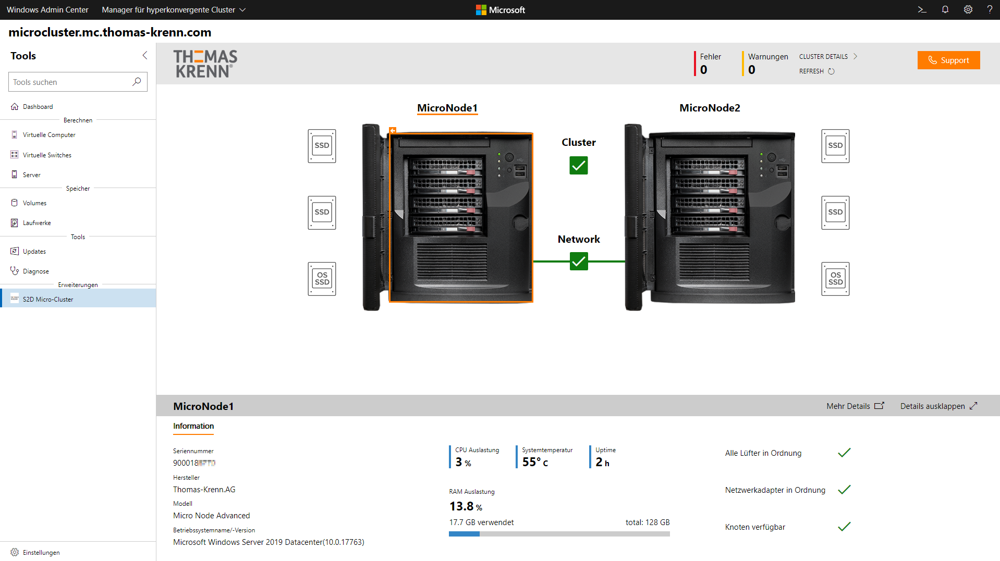
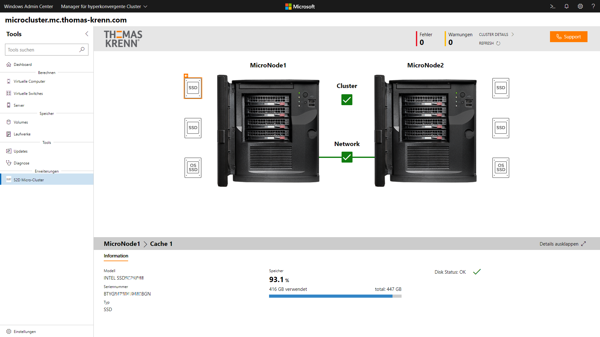
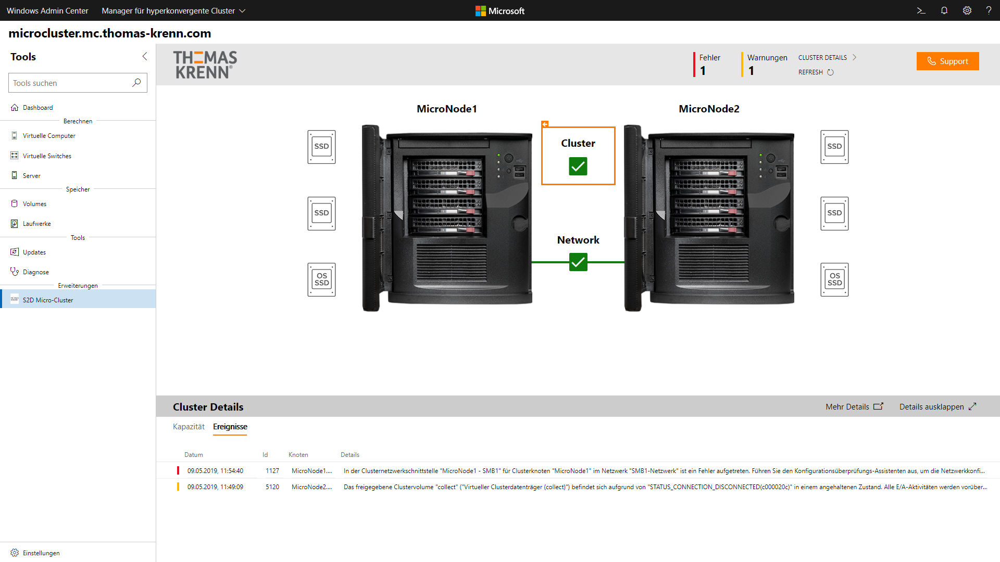
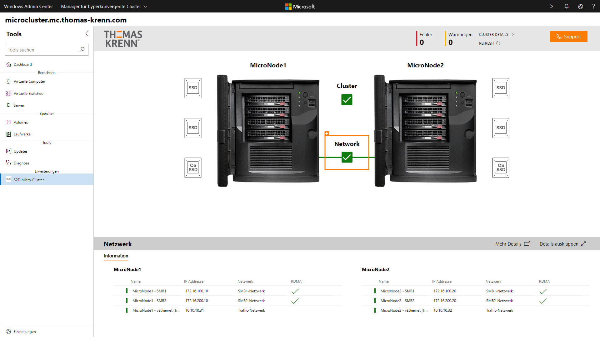
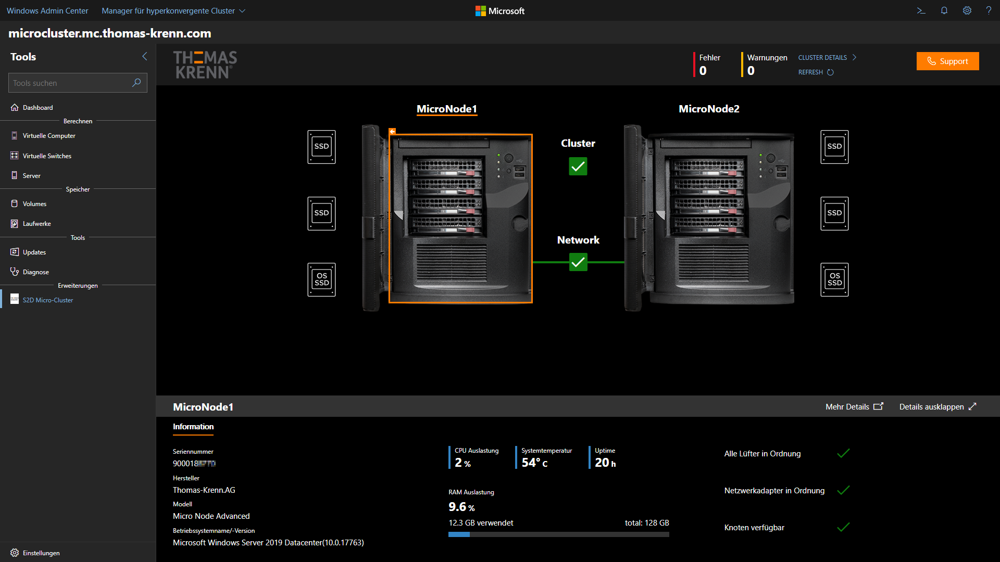

# Windows Admin Center Extension der Thomas Krenn.AG

## Einfache Storage-Verwaltung dank intuitiver Benutzeroberfläche

Die Thomas Krenn.AG ist ein führender, wachstumsstarker Hersteller individueller Server- und Storage-Systeme. Die Windows Admin Center Extension der Thomas-Krenn.AG wurde speziell für den [S2D Micro-Cluster](https://www.thomas-krenn.com/de/produkte/einsatzzweck/software-defined-storage/s2d-micro-cluster.html), ein hochverfügbares 2 Node Cluster, entwickelt. Mit der nutzerfreundlichen Bedienoberfläche der Extension haben Sie den Status Ihres Systems über das Windows Admin Center jederzeit im Blick. Ob einzelne Datenträger, Clusterstatus oder Netzwerkschnittstellen, wählen Sie einfach per Mausklick die verschiedenen Elemente der grafischen Bedienoberfläche aus und Sie erhalten sofort einen Überblick über die wichtigsten Eigenschaften Ihres Clusters.

Auch ein schneller Zugriff auf Seriennummern, Betriebssystemversion und Speicherauslastung ist jederzeit möglich. Zudem lässt sich für die gesamte Erweiterung auch ein „Dark-Mode“ aktiveren. Dank der Windows Admin Center Extension der Thomas-Krenn.AG haben Sie somit die Verwaltung Ihres S2D Micro-Clusters immer bestens im Griff.

Die Extension bietet eine Vielzahl an Möglichkeiten, wie der Status der Systeme und des Clusters abgerufen werden kann:
- Informationen der MicroNodes abrufen
- Status und Zustand der Betriebssystem-Disk
- Zustand der Capacity-HDDs sowie der Caching-SSDs
- Cluster-Übersicht sowie Cluster-Events
- Informationen über das Netzwerk 

Auf einen Blick finden Sie alle notwendigen Informationen über die Micro-Nodes. Hierzu zählen zum Beispiel Seriennummer, Modell, Betriebssystemversion und Systemauslastung. Außerdem erkennt man sofort, ob alle Lüfter und Netzwerkadapter ordnungsgemäß funktionieren.

Bei den Informationen über die Betriebssystem SSD sehen Sie die genaue Modellbezeichnung, die Seriennummer sowie den SMART-Zustand. Zusätzlich wird die Speicherauslastung des Speichermediums grafisch dargestellt.

Durch Anklicken der Caching-SSDs oder der Capacity-HDDs kann deren Zustand kinderleicht ausgelesen werden. Hier finden Sie ebenfalls die genaue Modellbezeichnung, die Seriennummern und die Speicherauslastung in grafischer Darstellung.

In der Cluster-Darstellung sehen Sie auf den ersten Blick den DNS-Namen, die IP-Adresse und den Status des Clusters. Außerdem wird die Storage-Pool-Kapazität sowie die Auslastung der einzelnen Cluster-Nodes grafisch angezeigt.

Zusätzlich zu den Cluster-Informationen werden die Cluster-Ereignisse in tabellarischer Form dargestellt, hierbei wird zwischen Warnungen und Fehlern unterschieden.

Um Informationen über die Netzwerkschnittstellen abrufen zu können, drücken Sie einfach auf das Network Symbol. Hier sehen Sie die Namen der NICs, die konfigurierte IP Adresse und den Netzwerknamen. Außerdem sehen Sie auf einen Blick, ob für die iWARP-fähigen Netzwerkkarten RDMA aktiviert ist.

Die Windows Admin Center Extension der Thomas Krenn.AG unterstützt den in der Version 1904 neu eingeführten „Dark-Mode“.

Mit dem [S2D Micro-Cluster](https://www.thomas-krenn.com/de/produkte/einsatzzweck/software-defined-storage/s2d-micro-cluster.html) haben die Techniker der Thomas Krenn.AG mit Unterstützung von Microsoft ein System entwickelt, das perfekt auf Storage Spaces Direct zugeschnitten ist. Und dank der speziell entwickelten Windows Admin Center Extension können Sie den Status des 2-Node-Clusters jederzeit über eine grafische Benutzeroberfläche im Webbrowser einsehen. Damit steht Anwendern von Windows Server ein kompaktes Komplettsystem mit hoher Leistungsdichte für Hyperkonvergenz und Software-definierten Storage zur Verfügung.
